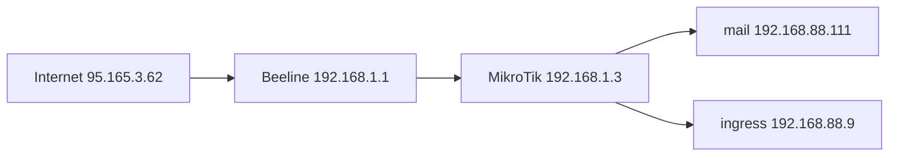

# mail — GitOps manifests for docker-mailserver on sion2k.ru

Kubernetes deployment of [docker-mailserver](https://github.com/docker-mailserver/docker-mailserver) for domain **sion2k.ru**, managed via Argo CD in namespace `shturval-cd`.

## Layout

| Path | Purpose |
|------|---------|
| `values.yaml` | Helm values for official `docker-mailserver` chart |
| `deploy/` | cert-manager Certificate for `mail.sion2k.ru` |
| `argocd/` | Argo CD Application (multi-source: Helm + values + deploy) |
| `ops/` | Apply Argo CD app and bootstrap mailbox/DKIM |

## Architecture

- **FQDN:** `mail.sion2k.ru`
- **Mailbox:** `vladimir@sion2k.ru`
- **Alias:** `postmaster@sion2k.ru` → `vladimir@sion2k.ru`
- **LoadBalancer VIP:** `192.168.88.111` (kube-vip; `.25` is occupied on LAN)
- **Public IP:** `95.165.3.62` — port-specific DNAT on router
- **TLS:** cert-manager `corp-acme` (HTTP-01 via nginx ingress)
- **Storage:** `proxmox-data-xfs`

Mail ports (25, 465, 587, 993, 4190) hit the mail VIP. HTTP/HTTPS for ACME (`mail.sion2k.ru:80/443`) must reach ingress `192.168.88.9`, not the mail pod.

### Enabled features (values.yaml)

| Env | Purpose |
|-----|---------|
| `ENABLE_RSPAMD=1` | Anti-spam, DKIM signing |
| `ENABLE_MANAGESIEVE=1` | Server-side Sieve filters (port 4190) |
| `ENABLE_DNSBL=1` | Postscreen DNS blocklists |
| `MOVE_SPAM_TO_JUNK=1` | Deliver spam to Junk folder |
| `RSPAMD_GREYLISTING=1` | Greylisting for suspicious senders |
| `RSPAMD_LEARN=1` | Learn spam/ham when moving mail to/from Junk |
| `SPOOF_PROTECTION=1` | Deny sending with forged From address |
| `ENABLE_UPDATE_CHECK=0` | No upgrade notification emails |

## Prerequisites

- Cluster: `sion2k-cluster` with cert-manager, kube-vip, nginx ingress
- DNS A record: `mail.sion2k.ru` → `95.165.3.62`
- Router DNAT (see below)

## Quick start

1. Push this repo to GitHub (or ensure `main` is up to date).

2. Apply Argo CD Application:

```bash
./ops/apply-argocd.sh
```

3. Wait for sync, TLS certificate, and LoadBalancer:

```bash
kubectl -n shturval-cd get application mail
kubectl -n mail get certificate,pods,svc
kubectl -n mail get svc docker-mailserver -o wide
```

4. Bootstrap mailbox (password **not** stored in git):

```bash
chmod +x ops/*.sh
./ops/bootstrap-mailbox.sh 'your-strong-password'
```

## Router DNAT (two-tier)

Public IP `95.165.3.62` (Beeline) → MikroTik WAN `192.168.1.3` (ether1) → k8s VIPs.



### Beeline router (192.168.1.1) → MikroTik WAN (192.168.1.3)

| Protocol | External port | Internal IP | Internal port | Purpose |
|----------|---------------|-------------|---------------|---------|
| TCP | 25 | 192.168.1.3 | 25 | SMTP (inbound mail) |
| TCP | 465 | 192.168.1.3 | 465 | SMTPS (send, SSL) |
| TCP | 587 | 192.168.1.3 | 587 | Submission (send, STARTTLS) |
| TCP | 993 | 192.168.1.3 | 993 | IMAPS (read mail) |
| TCP | 4190 | 192.168.1.3 | 4190 | ManageSieve (server filters) |

Already required for ingress / ACME:

| Protocol | External port | Internal IP | Internal port |
|----------|---------------|-------------|---------------|
| TCP | 80 | 192.168.1.3 | 80 |
| TCP | 443 | 192.168.1.3 | 443 |

Do **not** expose: TCP 143 (IMAP cleartext), TCP 11334 (Rspamd admin).

### MikroTik (admin@192.168.88.1) → k8s LoadBalancer

Applied on `ether1` (`action=netmap`, same style as Plex/minecraft rules):

| External port | Target | Purpose |
|---------------|--------|---------|
| TCP 25 | 192.168.88.111 | SMTP |
| TCP 465 | 192.168.88.111 | SMTPS |
| TCP 587 | 192.168.88.111 | Submission |
| TCP 993 | 192.168.88.111 | IMAPS |
| TCP 4190 | 192.168.88.111 | ManageSieve |
| TCP 80 | 192.168.88.9 | HTTP (ACME) — already configured |
| TCP 443 | 192.168.88.9 | HTTPS (ingress) — already configured |

Example (already applied):

```routeros
/ip firewall nat
add chain=dstnat action=netmap to-addresses=192.168.88.111 protocol=tcp in-interface=ether1 dst-port=25 comment="mail smtp"
add chain=dstnat action=netmap to-addresses=192.168.88.111 protocol=tcp in-interface=ether1 dst-port=465 comment="mail submissions"
add chain=dstnat action=netmap to-addresses=192.168.88.111 protocol=tcp in-interface=ether1 dst-port=587 comment="mail submission"
add chain=dstnat action=netmap to-addresses=192.168.88.111 protocol=tcp in-interface=ether1 dst-port=993 comment="mail imaps"
add chain=dstnat action=netmap to-addresses=192.168.88.111 protocol=tcp in-interface=ether1 dst-port=4190 comment="mail managesieve"
```

Verify on MikroTik:

```bash
ssh admin@192.168.88.1 '/ip firewall nat print where comment~"mail"'
```


## DNS (nic.ru)

Fix and complete after deploy:

| Type | Name | Value |
|------|------|-------|
| MX | `sion2k.ru` | `10 mail.sion2k.ru.` (**not** bare IP) |
| A | `mail.sion2k.ru` | `95.165.3.62` |
| TXT | `sion2k.ru` | `v=spf1 mx ~all` |
| TXT | `mail._domainkey.sion2k.ru` | from `./ops/bootstrap-mailbox.sh` output |
| TXT | `_dmarc.sion2k.ru` | `v=DMARC1; p=none; rua=mailto:vladimir@sion2k.ru` |
| PTR | `95.165.3.62` | `mail.sion2k.ru` (request from ISP) |

**Current issue:** MX points to `95.165.3.62` instead of `mail.sion2k.ru` — fix before relying on inbound mail.

## Client settings

| Setting | Value |
|---------|-------|
| IMAP | `mail.sion2k.ru`, port 993, SSL/TLS |
| SMTP | `mail.sion2k.ru`, port 587, STARTTLS |
| SMTP (SSL) | port 465 |
| ManageSieve | `mail.sion2k.ru`, port 4190, STARTTLS (Evolution filters) |
| Username | full address `vladimir@sion2k.ru` |

## Verify

```bash
dig +short MX sion2k.ru
dig +short A mail.sion2k.ru
openssl s_client -connect mail.sion2k.ru:993 -servername mail.sion2k.ru </dev/null
kubectl -n mail logs deploy/docker-mailserver --tail=50
```

Send a test message via [mail-tester.com](https://www.mail-tester.com/) after SPF/DKIM/DMARC/PTR are set.

## Notes

- **Port 25:** Beeline may block outbound/inbound SMTP on residential lines; if mail fails, check ISP policy first.
- **proxyProtocol:** disabled — kube-vip is not HAProxy.
- **ClamAV / Fail2ban:** disabled to reduce resource use in Kubernetes.
- **Rspamd:** enabled (DKIM signing via Rspamd, greylisting, Bayes learning)
- **DNSBL / greylisting:** first mail from new senders may be delayed; disable `ENABLE_DNSBL` if legitimate mail is rejected

## Chart reference

- Helm repo: `https://docker-mailserver.github.io/docker-mailserver-helm`
- Chart: `docker-mailserver` **5.1.1**
- Image: `ghcr.io/docker-mailserver/docker-mailserver:16.0.1`
